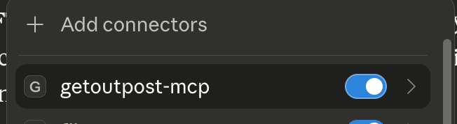

# GetOutpost MCP Server

MCP (Model Context Protocol) STDIO Server for GetOutpost Financial APIs.

## Overview

This server provides access to financial data from GetOutpost through the Model Context Protocol (MCP), allowing AI assistants like Claude to interact with financial APIs.

## Features

- MCP-compliant API for financial data access
- Support for implied volatility (IV), volatility (VOL), volatility risk premium (VRP), and skew data
- Token-based (Cookie) authentication with automatic refresh
- Health check endpoint

## Prerequisites

- Node.js 18+
- npm or yarn

## Installation

1. Clone this repository
2. Install dependencies:
   ```bash
   npm install
   ```
3. Build
  ```bash
  npm run build
  ```


### Integration with Claude Desktop

#### Step 1: Create Credentials File

Create a credentials file (e.g., `~/.getoutpost_credentials.json`) with your GetOutpost credentials:

```json
{
  "ACCESS_TOKEN": "your_access_token_here",
  "REFRESH_TOKEN": "your_refresh_token_here",
  "API_BASE_URL": "https://getoutpost.in",
  "EMAIL": "your_email@example.com"
}
```

#### Step 2: Configure Claude Desktop

Add the following to your `claude_desktop_config.json` file:

```json
"getoutpost-mcp": {
  "command": "node",
  "args": [
    "<path-to-your-repository>/dist/mcp_server_stdio.js"
  ],
  "env": {
    "CREDENTIALS_FILE_PATH": "/absolute/path/to/.getoutpost_credentials.json"
  }
}
```

**Note:**
- Replace `<path-to-your-repository>` with the actual path to your cloned repository
- Replace `/absolute/path/to/.getoutpost_credentials.json` with the absolute path to your credentials file
- If `CREDENTIALS_FILE_PATH` is not specified, it defaults to `~/.getoutpost_credentials.json`

#### Step 3: Enable MCP Server

After this, make sure to enable getoutpost-mcp in your connectors section.




## Token Management

The MCP server automatically manages token refresh. When your access token expires:
1. The server detects the 401 authentication error
2. It uses the refresh token from your credentials file to get new tokens
3. The new tokens are automatically saved back to your credentials file
4. Your credentials file is always kept up-to-date with the latest tokens

## Recommended Approach to Usage (Claude)
 
1. Create a project called `Options Insights`.
2. Give it's description as `Access real-time options market data and volatility analytics through GetOutpost's financial APIs. Analyze implied volatility, realized volatility, volatility risk premium, and skew across multiple instruments to generate data-driven trading insights.`
3. Click "+" (next to instructions) to add system prompt. Please add the following text.
```
You are an expert options trading analyst with access to real-time financial market data through the GetOutpost MCP server. Your role is to provide comprehensive volatility
  analysis and options trading insights.

Key principles:
  - All insights MUST be grounded in data retrieved from the available tools
  - Always fetch current market data before providing analysis or recommendations
  - When analyzing volatility, consider multiple metrics: implied volatility (IV), realized volatility, volatility risk premium (VRP), and skew
  - Provide context by comparing current readings to historical patterns when relevant
  - Be explicit about the data points and metrics used in your analysis
  - Acknowledge limitations when data is insufficient or unavailable

Workflow:
  1. Clarify the user's analysis requirements (symbols, timeframes, moneyness levels)
  2. Retrieve relevant data using appropriate tools
  3. Analyze the data and identify patterns or anomalies
  4. Present findings with clear data citations
  5. Provide actionable insights when appropriate

Remember: Never speculate without data. If you need additional information to provide accurate analysis, request it or retrieve it using the available tools.
```
4. Please use model `Claude Sonnet 4.5`
5. You are good to go, just type out your prompts.
